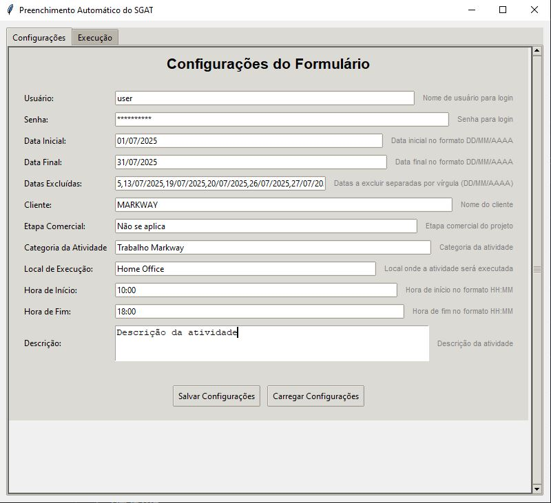
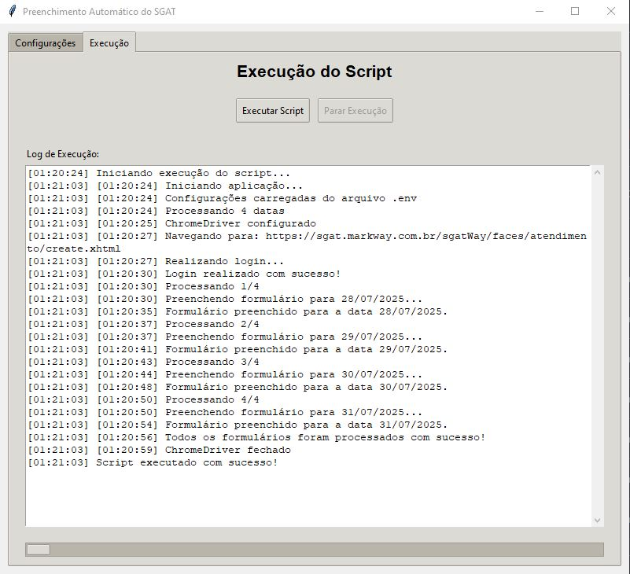

# SGAT Form Autofill - Versão 2.0

SGAT (Markway) é um sistema de controle de horas utilizado por empresas para que colaboradores registrem suas atividades e apontem as horas trabalhadas em projetos e atendimentos. O preenchimento desses formulários é uma tarefa recorrente e manual, exigindo que o funcionário detalhe diariamente suas horas no sistema.

Este aplicativo desktop automatiza o preenchimento desses formulários no SGAT, utilizando Python e Selenium. Agora, com uma interface gráfica amigável (Tkinter), o script realiza login automático, preenche campos configuráveis do formulário de atendimento e executa esse processo para um intervalo de datas, excluindo feriados, folgas ou dias específicos definidos.

<div align="center">
  
  <p><em>Figure 1: Configurações iniciais</em></p>
</div>

<div align="center">
  
  <p><em>Figure 1: Execução do programa</em></p>
</div>

---

## 📌 Funcionalidades

- **Interface Gráfica (Tkinter)**: Configuração intuitiva das variáveis e acompanhamento da execução.
- **ChromeDriver Integrado**: O executável do ChromeDriver (para Windows) é incluído no pacote, eliminando a necessidade de download e configuração manual.
- **Geração Automática de `.env`**: O arquivo de configuração `.env` é criado e atualizado diretamente pela interface gráfica.
- Login automático no sistema SGAT.
- Preenchimento de formulário com dados configuráveis.
- Execução para um intervalo de datas (com exclusões).
- Navegação e submissão automática.
- Log de execução em tempo real na interface.

---

## 📁 Estrutura dos Arquivos

```
projeto/
├── assets              # Imagens do programa
├── app_gui.py          # Interface gráfica principal do aplicativo
├── main.py             # Script de automação principal (adaptado para GUI e multi-OS)
├── chromedriver        # Executável do ChromeDriver para Windows
├── requirements.txt    # Dependências Python do projeto
├── README.md           # Esta documentação
├── run.bat             # Script de inicialização para Windows
├── run.sh              # Script de inicialização para Linux/macOS
└── .env                # Arquivo de configuração (gerado e gerenciado pela GUI)
```

---

## ⚙️ Requisitos

- Python 3.11+ (versões anteriores podem funcionar, mas 3.11+ é recomendado).
- Google Chrome instalado no seu sistema.

---

## 🚀 Como Usar

### 1. Iniciar o Aplicativo

-   **No Windows**: Clique duas vezes no arquivo `run.bat` ou execute-o no prompt de comando:
    ```bash
    run.bat
    ```

### 2. Configurar as Variáveis

Ao abrir o aplicativo, você verá uma interface com duas abas. Na aba "**Configurações**", preencha todos os campos:

-   **Usuário**: Seu nome de usuário para login no sistema SGAT.
-   **Senha**: Sua senha para login no sistema SGAT.
-   **Data Inicial**: A primeira data do intervalo para preenchimento (formato `DD/MM/AAAA`).
-   **Data Final**: A última data do intervalo para preenchimento (formato `DD/MM/AAAA`).
-   **Datas Excluídas**: Datas específicas que devem ser ignoradas, separadas por vírgula (ex: `03/07/2025, 04/07/2025`). Este campo é opcional.
-   **Cliente**: O nome do cliente a ser selecionado no formulário.
-   **Etapa Comercial**: A etapa comercial a ser selecionada.
-   **Categoria da Atividade**: A categoria da atividade a ser selecionada.
-   **Local de Execução**: O local onde a atividade foi executada.
-   **Hora de Início**: A hora de início da atividade (formato `HH:MM`).
-   **Hora de Fim**: A hora de término da atividade (formato `HH:MM`).
-   **Descrição**: Uma descrição detalhada da atividade a ser registrada.

### 3. Salvar Configurações

Após preencher todos os campos, clique no botão "**Salvar Configurações**". Isso irá gerar ou atualizar o arquivo `.env` na raiz do projeto com os valores que você inseriu.

### 4. Executar o Script

1.  Vá para a aba "**Execução**".
2.  Clique no botão "**Executar Script**".
3.  Acompanhe o progresso e as mensagens de log na área de texto abaixo. Você verá o navegador Chrome sendo controlado automaticamente.

---

## 🔧 Configuração Avançada do `.env`

Embora o aplicativo gerencie o `.env` automaticamente, você pode editá-lo manualmente se necessário. O formato esperado é:

```env
USUARIO="seu_usuario"
SENHA="sua_senha"
DATA_INICIAL="01/07/2025"
DATA_FINAL="31/07/2025"
DATAS_EXCLUIDAS="03/07/2025, 04/07/2025"
CLIENTE="MARKWAY"
ETAPA_COMERCIAL="Não se aplica"
CATEGORIA_ATIVIDADE="Trabalho Markway"
LOCAL_EXECUCAO="Home Office"
HORA_INICIO="10:00"
HORA_FIM="18:00"
DESCRICAO="Descrição da atividade"
```

---

## 💡 Dicas e Solução de Problemas

### ChromeDriver

-   **Erro "ChromeDriver not found"**: Verifique se o arquivo `chromedriver` está no mesmo diretório do aplicativo.
-   **Erro "WinError 193" (Windows)**: Este erro geralmente indica uma incompatibilidade. Certifique-se de que o `chromedriver.exe` incluído no pacote é a versão correta para o seu sistema Windows 64-bit e que seu Google Chrome está atualizado.

### Selenium e Preenchimento de Formulário

-   **Elementos não encontrados**: O script `main.py` foi adaptado para os seletores que você forneceu. Se o layout do formulário SGAT mudar, pode ser necessário ajustar os seletores `By.ID` e `By.LINK_TEXT` dentro da função `fill_form` no `main.py`.
-   **Timeout**: Se a página demorar para carregar, você pode aumentar o valor do `WebDriverWait` (atualmente 10 segundos) no `main.py`.
-   **Pausas (`time.sleep`)**: As pausas foram ajustadas para o seu exemplo. Se o formulário tiver comportamentos assíncronos ou animações, pode ser necessário ajustar os `time.sleep()` para garantir que os elementos estejam prontos para interação.

---

## 🛠 Tecnologias Utilizadas

-   **Python 3.11+**
-   **Tkinter**: Para a interface gráfica do usuário.
-   **Selenium WebDriver**: Para automação do navegador.
-   **python-dotenv**: Para gerenciamento das variáveis de ambiente.

---

## 🤝 Compatibilidade

-   **Sistemas Operacionais**: Windows (64-bit)
-   **Python**: 3.11+.
-   **Navegador**: Google Chrome (versão 128+).

---

Desenvolvido para automatizar tarefas repetitivas no SGAT, economizando tempo com segurança e confiabilidade. Para problemas específicos do formulário, consulte o código-fonte de `main.py`.

